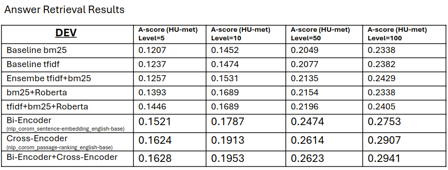

# AVeriTeC

Data, knowledge store and source code to reproduce the baseline experiments for the [AVeriTeC](https://arxiv.org/abs/2305.13117) dataset, which will be used for the 7th [FEVER](https://fever.ai/) workshop co-hosted at EMNLP 2024.

## :rocket: Our Progress
<hr>

+ May-6  : Learn the [AVeriTeC Higgigface](https://huggingface.co/chenxwh/AVeriTeC) data, code and task.
+ May-12 : Setup script to **evaluate sentence retrieval**
+ May-30 : Applied Roberta to rerank sentenses in Step-2 *knowledge_store* on the retieved sentences from BM25+TFIDF. But much improvement seen with bi-encoder and cross-encoder retrieval. But both took around 2 days on `dev` sentence retrieval.
+ Next : Get also **top100** sentences for `train` split.
+ Later Next : Apply MultiStage Retreival: <br>
    Roberta🠊HybRank🠊HLATR.
+ More Later: Check if MultiStage Retreival is also useful in reranking QA pairs in Step-4.

<hr>




## Task done

  ### Applied bi-encoder and cross-encoder for sentences retrieval


  ### Generated pos-neg data for contrastive-learning based roberta_sentence_selector
  ```
    PYTHONPATH=src python src/my_methods/roberta_sentence_selector/generate_pairs.py
  ```

  ### Setup script to evaluate sentence retrieval
   * Modfied `src/prediction/evaluate_veracity.py` to include `evaluate_answers_only`:
   * To call `evaluate_answers_only()`, follow:

   ```python
   # predictions contains predicted QAs
   predictions = [{"claim_id":0,"claim":"In a letter to Steve Jobs, Sean Connery refused to appear in an apple commercial.","evidence":[{"question":"Did Sean connery send a fake letter about real Steve jobs?","answer":"Also, fake Sean Connery sent a letter to Real Steve Jobs.","url":"https://www.nbcnews.com/news/world/pre-caffeine-tech-apple-gossip-smart-pugs-flna122578"},{"question":"Did President Trump tell the truth about the fake letter to Apple CEO Steve Job Jobs Jobs  Question answer:  Yes, Trump said it was fake.?","answer":"Thanks to the confluence of my interests and the fact that it’s funny as hell, I’ve been inundated with email regarding Scoopertino’s fake 1998 letter from Sean Connery to Steve Jobs.","url":"https://maclalala2.wordpress.com/2011/06/24/%E3%81%9F%E3%81%8B%E3%81%8C%E3%82%B3%E3%83%B3%E3%83%94%E3%83%A5%E3%83%BC%E3%82%BF%E3%82%BB%E3%83%BC%E3%83%AB%E3%82%B9%E3%83%9E%E3%83%B3%E3%81%AE%E3%81%9F%E3%82%81%E3%81%AB%E3%82%B8%E3%82%A7%E3%83%BC/"},{"question":"Did Steve Job send a letter of refusal to a movie called James Bond?","answer":"First, the bad news. Sean Connery never actually sent a typewritten letter to Steve Jobs in 1998 refusing to be in an Apple ad.","url":"https://www.cnet.com/culture/fake-sean-connery-letter-to-steve-jobs-goes-viral/"}],"pred_label":"Conflicting Evidence/Cherrypicking"}]

   # references contains gold QAs
   references = [{"claim":"In a letter to Steve Jobs, Sean Connery refused to appear in an apple commercial.","required_reannotation":"false","label":"Refuted","justification":"The answer and sources show that the claim was published in a fake news site so the claim is refuted.","claim_date":"31-10-2020","speaker":"null","original_claim_url":"null","fact_checking_article":"https://web.archive.org/web/20201130144023/https://checkyourfact.com/2020/11/03/fact-check-sean-connery-letter-steve-jobs-apple-1998/","reporting_source":"Facebook","location_ISO_code":"null","claim_types":["Event/Property Claim"],"fact_checking_strategies":["Written Evidence"],"questions":[{"question":"Where was the claim first published","answers":[{"answer":"It was first published on Sccopertino","answer_type":"Abstractive","source_url":"https://web.archive.org/web/20201129141238/https://scoopertino.com/exposed-the-imac-disaster-that-almost-was/","source_medium":"Web text","cached_source_url":"https://web.archive.org/web/20201129141238/https://scoopertino.com/exposed-the-imac-disaster-that-almost-was/"}]},{"question":"What kind of website is Scoopertino","answers":[{"answer":"Scoopertino is an imaginary news organization devoted to ferreting out the most relevant stories in the world of Apple, whether or not they actually occurred - says their about page","answer_type":"Extractive","source_url":"https://web.archive.org/web/20201202085933/https://scoopertino.com/about-scoopertino/","source_medium":"Web text","cached_source_url":"https://web.archive.org/web/20201202085933/https://scoopertino.com/about-scoopertino/"}]}],"cached_original_claim_url":"null"}]

   from src.prediction.evaluate_veracity import AVeriTeCEvaluator, print_with_space
   scorer = AVeriTeCEvaluator()
   a_score = scorer.evaluate_answers_only(predictions, references)
   print_with_space("Answer-only score (HU-" + scorer.metric + "):", str(a_score))

   ```

## NEWS:
 - 19.04.2024: The submisstion page (with eval.ai) for the shared-task is alive, you can participate by submitting your predictions [here](https://eval.ai/web/challenges/challenge-page/2285/overview)!

## Dataset
The training and dev dataset can be found under [data](https://huggingface.co/chenxwh/AVeriTeC/tree/main/data). Test data will be released at a later date. Each claim follows the following structure:
```json
{
    "claim": "The claim text itself",
    "required_reannotation": "True or False. Denotes that the claim received a second round of QG-QA and quality control annotation.",
    "label": "The annotated verdict for the claim",
    "justification": "A textual justification explaining how the verdict was reached from the question-answer pairs.",
    "claim_date": "Our best estimate for the date the claim first appeared",
    "speaker": "The person or organization that made the claim, e.g. Barrack Obama, The Onion.",
    "original_claim_url": "If the claim first appeared on the internet, a url to the original location",
    "cached_original_claim_url": "Where possible, an archive.org link to the original claim url",
    "fact_checking_article": "The fact-checking article we extracted the claim from",
    "reporting_source": "The website or organization that first published the claim, e.g. Facebook, CNN.",
    "location_ISO_code": "The location most relevant for the claim. Highly useful for search.",
    "claim_types": [
            "The types of the claim",
    ],
    "fact_checking_strategies": [
        "The strategies employed in the fact-checking article",
    ],
    "questions": [
        {
            "question": "A fact-checking question for the claim",
            "answers": [
                {
                    "answer": "The answer to the question",
                    "answer_type": "Whether the answer was abstractive, extractive, boolean, or unanswerable",
                    "source_url": "The source url for the answer",
                    "cached_source_url": "An archive.org link for the source url"
                    "source_medium": "The medium the answer appeared in, e.g. web text, a pdf, or an image.",
                }
            ]
        },
    ]
}
```

## Reproduce the baseline

Below are the steps to reproduce the baseline results. The main difference from the reported results in the paper is that, instead of requiring direct access to the paid Google Search API, we provide such search results for up to 1000 URLs per claim using different queries, and the scraped text as a knowledge store for retrieval for each claim. This is aimed at reducing the overhead cost of participating in the Shared Task. Another difference is that we also added text scraped from pdf URLs to the knowledge store.


### 0. Set up environment

You will need to have [Git LFS](https://git-lfs.com/) installed:
```bash
git lfs install
git clone https://huggingface.co/chenxwh/AVeriTeC
```
You can also skip the large files in the repo and selectively download them later:
```bash
GIT_LFS_SKIP_SMUDGE=1 git clone https://huggingface.co/chenxwh/AVeriTeC
```
Then create `conda` environment and install the libs.

```bash
conda create -n averitec python=3.11
conda activate averitec

pip install -r requirements.txt
python -m spacy download en_core_web_lg
python -m nltk.downloader punkt
python -m nltk.downloader wordnet
conda install pytorch pytorch-cuda=11.8 -c pytorch -c nvidia
```

### 1. Scrape text from the URLs obtained by searching queries with the Google API

The URLs of the search results and queries used for each claim can be found [here](https://huggingface.co/chenxwh/AVeriTeC/tree/main/data_store/urls).

 Next, we scrape the text from the URLs and parse the text to sentences. The processed files are also provided and can be found [here](https://huggingface.co/chenxwh/AVeriTeC/tree/main/data_store/knowledge_store). You can use your own scraping tool to extract sentences from the URLs.

```bash
bash script/scraper.sh <split> <start_idx> <end_idx>
# e.g., bash script/scraper.sh dev 0 500
```

### 2. Rank the sentences in the knowledge store with BM25
Then, we rank the scraped sentences for each claim using BM25 (based on the similarity to the claim), keeping the top 100 sentences per claim.
See [bm25_sentences.py](https://huggingface.co/chenxwh/AVeriTeC/blob/main/src/reranking/bm25_sentences.py) for more argument options. We provide the output file for this step on the dev set [here](https://huggingface.co/chenxwh/AVeriTeC/blob/main/data_store/dev_top_k_sentences.json).
```bash
python -m src.reranking.bm25_sentences
```

### 3. Generate questions-answer pair for the top sentences
We use [BLOOM](https://huggingface.co/bigscience/bloom-7b1) to generate QA paris for each of the top 100 sentence, providing 10 closest claim-QA-pairs from the training set as in-context examples. See [question_generation_top_sentences.py](https://huggingface.co/chenxwh/AVeriTeC/blob/main/src/reranking/question_generation_top_sentences.py) for more argument options. We provide the output file for this step on the dev set [here](https://huggingface.co/chenxwh/AVeriTeC/blob/main/data_store/dev_top_k_qa.json).
```bash
python -m src.reranking.question_generation_top_sentences
```

### 4. Rerank the QA pairs
Using a pre-trained BERT model [bert_dual_encoder.ckpt](https://huggingface.co/chenxwh/AVeriTeC/blob/main/pretrained_models/bert_dual_encoder.ckpt), we rerank the QA paris and keep top 3 QA paris as evidence. See [rerank_questions.py](https://huggingface.co/chenxwh/AVeriTeC/blob/main/src/reranking/rerank_questions.py) for more argument options. We provide the output file for this step on the dev set [here](https://huggingface.co/chenxwh/AVeriTeC/blob/main/data_store/dev_top_3_rerank_qa.json).
```bash
python -m src.reranking.rerank_questions
```


### 5. Veracity prediction
Finally, given a claim and its 3 QA pairs as evidence, we use another pre-trained BERT model [bert_veracity.ckpt](https://huggingface.co/chenxwh/AVeriTeC/blob/main/pretrained_models/bert_veracity.ckpt) to predict the veracity label. See [veracity_prediction.py](https://huggingface.co/chenxwh/AVeriTeC/blob/main/src/prediction/veracity_prediction.py) for more argument options. We provide the prediction file for this step on the dev set [here](https://huggingface.co/chenxwh/AVeriTeC/blob/main/data_store/dev_veracity_prediction.json).
```bash
python -m src.prediction.veracity_prediction
```

Then evaluate the veracity prediction performance with (see [evaluate_veracity.py](https://huggingface.co/chenxwh/AVeriTeC/blob/main/src/prediction/evaluate_veracity.py) for more argument options):
```bash
python -m src.prediction.evaluate_veracity
```

The result for dev and the test set below. We recommend using 0.25 as cut-off score for evaluating the relevance of the evidence.

| Model             | Split	| Q only | Q + A | Veracity @ 0.2 | @ 0.25 | @ 0.3 |
|-------------------|-------|--------|-------|----------------|--------|-------|
| AVeriTeC-BLOOM-7b | dev	|  0.240 | 0.185 | 	    0.186     |  0.092 | 0.050 |
| AVeriTeC-BLOOM-7b | test	|  0.248 | 0.185 |  	0.176     |  0.109 | 0.059 |

## Citation
If you find AVeriTeC useful for your research and applications, please cite us using this BibTeX:
```bibtex
@inproceedings{
  schlichtkrull2023averitec,
  title={{AV}eriTeC: A Dataset for Real-world Claim Verification with Evidence from the Web},
  author={Michael Sejr Schlichtkrull and Zhijiang Guo and Andreas Vlachos},
  booktitle={Thirty-seventh Conference on Neural Information Processing Systems Datasets and Benchmarks Track},
  year={2023},
  url={https://openreview.net/forum?id=fKzSz0oyaI}
}
```
